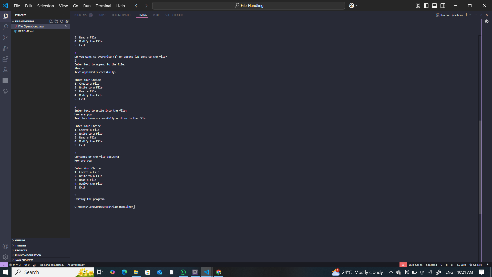

# File Operations Program in Java  

This is a simple Java program that allows users to perform basic file operations through a console-based menu-driven interface.  

## Features  

- **Create a File** – Allows users to create a new file with a specified name.  
- **Write to a File** – Enables users to write text into a file.  
- **Read a File** – Reads and displays the contents of the specified file.  
- **Modify a File** – Provides options to either overwrite or append text to an existing file.  
- **Exit** – Exits the program.  

